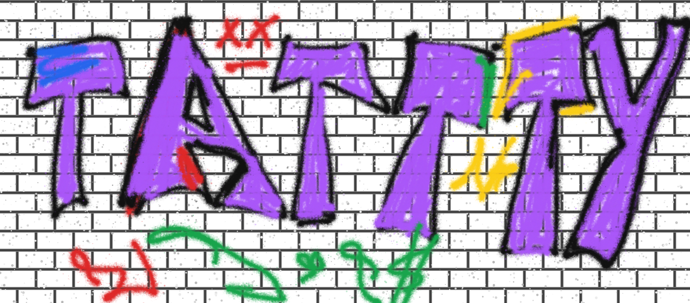

# Street Canvas - Graffiti Spray Paint



Create stunning street art on a realistic brick wall canvas with authentic spray paint dynamics.

## Features

🎨 **Realistic Spray Physics** - Authentic spray paint behavior with particle dispersion and fading effects
🧱 **Procedural Brick Wall** - Dynamic brick pattern background that creates the perfect urban canvas
🌈 **Multiple Colors** - Six vibrant spray paint colors including Fire Red, Electric Blue, Toxic Green, Neon Yellow, Purple Haze, and Midnight Black
📱 **Touch & Mouse Support** - Works seamlessly on both desktop and mobile devices
💾 **Download Artwork** - Save your creations as high-quality PNG files
🧹 **Easy Cleanup** - One-click clear button to start fresh

## Tech Stack

- **Next.js 15** - Modern React framework with App Router
- **TypeScript** - Type-safe development
- **Tailwind CSS** - Utility-first CSS framework
- **HTML5 Canvas** - High-performance drawing engine
- **Shadcn/ui** - Beautiful, accessible UI components

## Installation

```bash
# Clone the repository
git clone https://github.com/your-username/street-canvas.git

# Navigate to project directory
cd street-canvas

# Install dependencies
npm install

# Start development server
npm run dev

# Open http://localhost:3000 in your browser
```

## Usage

1. **Select a Color** - Click on any spray can to choose your paint color
2. **Start Spraying** - Click and drag on the canvas to create graffiti
3. **Adjust Pressure** - Move faster for lighter spray, slower for heavier coverage
4. **Clear Canvas** - Use the clear button to start over
5. **Download Art** - Save your masterpiece as a PNG file

## Embedding in Iframes

This application is optimized for iframe embedding. Use the following code to embed it in your website:

```html
<iframe
  src="https://graffiti-spray-experience.vercel.app/"
  width="100%"
  height="600"
  style="border:none; min-height: 100vh;"
  allowfullscreen
>
</iframe>
```

## Live Experience

Experience the graffiti spray canvas live on [tattty.com](https://graffiti-spray-experience.vercel.app/)

## Browser Support

- Chrome 90+
- Firefox 88+
- Safari 14+
- Edge 90+

## Contributing

Contributions are welcome! Please feel free to submit a Pull Request.

1. Fork the repository
2. Create your feature branch (`git checkout -b feature/amazing-feature`)
3. Commit your changes (`git commit -m 'Add some amazing feature'`)
4. Push to the branch (`git push origin feature/amazing-feature`)
5. Open a Pull Request

## License

This project is licensed under the MIT License - see the [LICENSE](LICENSE) file for details.

## Screenshots


## Support

If you encounter any issues or have suggestions for improvements, please [open an issue](https://github.com/your-username/street-canvas/issues) on GitHub.

---

**Created with ❤️ for street art enthusiasts everywhere**
